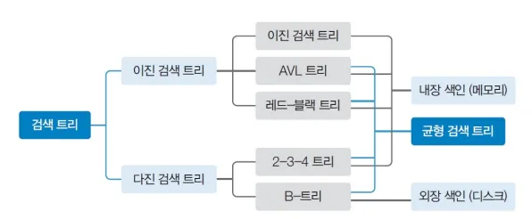
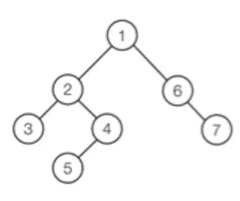
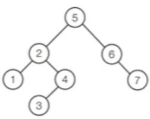
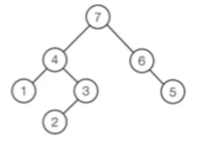

# 색인과 이진 검색 트리

## 색인

---

색인은 데이터를 찾을 때 사용되는 개념이다.  키와 페이지로 이루어져 있고 키를 이용해 페이지를 얻어 쉽게 데이터를 찾을 수 있다.

배열에 키를 정렬 시켜 트리 구조의 색인을 만들 때, 만약 각 노드가 갖고있는 값이 규칙 없이 중구난방이면 특정 값을 찾기 위해서는 최악의 경우 각각의 노드를 모두 순회(탐색)해야 한다. 따라서 색인을 구현할 때 검색 트리가 사용된다.



## 이진 검색 트리

---


**부모 노드(parent node)** : 자기 자신(노드)과 연결 된 노드 중 자신보다 높은 노드를 의미

**자식 노드(child node)** : 자기 자신(노드)과 연결 된 노드 중 자신보다 낮은 노드를 의미 

**루트 노드 (root node)** : 일명 뿌리 노드라고 하며 루트 노드는 하나의 트리에선 하나밖에 존재하지 않고, 부모노드가 없다.

**단말 노드(leaf node)** : 리프 노드라고도 불리며 자식 노드가 없는 노드를 의미한다. 

**내부 노드(internal node)** : 단말 노드가 아닌 노드

**형제 노드(sibling node)** : 부모가 같은 노드를 말한다. 

**깊이(depth)** : 특정 노드에 도달하기 위해 거쳐가야 하는 '간선의 개수'를 의미

**레벨(level)** : 특정 깊이에 있는 노드들의 집합을 말하며, 구현하는 사람에 따라 0 또는 1부터 시작한다. 

**차수(degree)** : 특정 노드가 하위(자식) 노드와 연결 된 개수 (이진트리의 경우 최대 차수가 2이다)

**이진 검색 트리의 특징**

1. 모든 원소는 모두 서로 다른 유일한 키를 갖는다.
2. 각 노드는 최대 2개의 자식을 갖는다(right, left)
3. 왼쪽 서브트리에 있는 원소의 키들은 루트의 키보다 작다.
4. 오른쪽 서브트리에 있는 원소의 키들은 루트의 키보다 크다.

---

### 검색

루트에서 시작하여 검색할 키 값을 루트 노드의 키값과 비교한다

ㄴ 서브 트리에 대해 순환적 탐색 연산을 반복한다

- **키 값 = 루트 노드의 키 값 :** 원하는 원소를 찾았으므로 탐색 연산 성공. 그 값을 반환
- **키 값 < 루트 노드의 키 값 :** 루트 노드의 왼쪽 서브 트리에 대해 탐색 연산 수행
- **키 값 > 루트 노드의 키 값 :** 루트 노드의 오른쪽 서브 트리에 대해 탐색 연산 수행

### 삽입

**① 검색 연산 수행**

: 삽입할 원소와 같은 원소가 트리에 있으면 삽입할 수 없으므로, 같은 원소가 트리에 있는지 탐색

**② 검색 실패한 위치에 원소를 삽입**

- 코드
    
    ```java
    * @param value 삽입하고자 하는 데이터
    * @return 정상적으로 삽입 되었을 경우 true, 중복 원소를 삽입할 경우 false를 반환
    */
    public boolean add(E value) {
    		
    	/* 
    	 * comparator(사용자 지정 비교기)가 없을 경우(=null)에는 Comparable,
    	 * 있을 경우에는 Comparator를 사용하는 메소드로 보낸다.
    	 * 그리고, 각 메소드는 정상적으로 삽입이 완료되었다면 null을 반환할 것이고,
    	 * 중복 원소를 삽입 할 경우 해당 value를 반환할 것이기 때문에
    	 * 비교 연산으로 null인지 아닌지 여부를 반환한다.
    	 */
    	if(comparator == null) {
    		return addUsingComparable(value) == null;
    	}
    	return addUsingComparator(value, comparator) == null;
    }
    	
    // Comparable을 이용한 add메소드
    private E addUsingComparable(E value) {
    	
    	Node<E> current = root; // 탐색할 노드를 가리키는 current node
    	
    	// 만약 current가 null, 즉 root가 null이면 root에 새 노드를 만들고 null반환
    	if(current == null) {
    		root = new Node<E>(value);
    		size++;
    		return null;
    	}
    		
    	Node<E> currentParent;	// current의 직전 탐색 노드를 가리키는 노드
    	
    	// 삽입 할 노드가 비교 될 수 있도록 한 변수를 만든다. 
    	@SuppressWarnings("unchecked")
    	Comparable<? super E> compValue = (Comparable<? super E>) value;
    	
    	int compResult;	// 비교 결과(양수, 0, 음수)를 담고 있을 변수
    	
    	do {
    		// 다음 순회에서 current의 부모노드를 가리킬 수 있도록 현재 current를 저장
    		currentParent = current;
    		
    		compResult = compValue.compareTo(current.value);
    		
    		/*
    		 * 비교 결과 value 보다 current.value 보다 작으면
    		 * current를 current의 왼쪽 자식으로 갱신하고,
    		 * value보다 current.value가 크다면 current를 오른쪽
    		 * 자식으로 갱신하며, 같을 경우 순회를 중단하고 value를 반환한다.
    		 */
    		if(compResult < 0) {
    			current = current.left;
    		} else if(compResult > 0) {
    			current = current.right;
    		}
    		else {
    			return value;
    		}
    		
    	} while(current != null);
    	
    	
    	// 순회가 완료되어 삽입해야 할 위치를 찾았다면 삽입 할 value를 노드로 만든다.
    	Node<E> newNode = new Node<E>(value, currentParent);
    	
    	// 직전 비교 결과에 따라 currentParent의 오른쪽 혹은 왼쪽 노드에 새 노드를 연결해준다.
    	if(compResult < 0) {
    		currentParent.left = newNode;
    	}
    	else {
    		currentParent.right = newNode;
    	}
    	
    	size++;
    	return null;
    }
     
    // Comparator을 이용한 add
    private E addUsingComparator(E value, Comparator<? super E> comp) {
    	
    	Node<E> current = root;
    	if(current == null) {
    		root = new Node<E>(value, null);
    		size++;
    		return null;
    	}
    	
    	Node<E> currentParent;
    	int compResult;
    	do {
    		currentParent = current;
    		compResult = comp.compare(value, current.value);
    		if(compResult < 0) {
    			current = current.left;
    		}
    		else if(compResult > 0) {
    			current = current.right;
    		}
    		else {
    			return value;
    		}
    	} while(current != null);
    	
    	Node<E> newNode = new Node<E>(value, currentParent);
    	if(compResult < 0) {
    		currentParent.left = newNode;
    	}
    	else {
    		currentParent.right = newNode;
    	}
    	size++;
    	return null;
    }
    ```
    

### 삭제

**① 검색 연산 수행**

: 삭제할 노드의 위치 찾기

**② 탐색하여 찾은 노드 삭제**

- ****노드의 삭제 후에도 이진 탐색 트리를 유지해야 하므로 삭제 노드의 경우 후속처리*가 필요하다
- 후속처리 : 이진 탐색 트리의 재구성 작업
    - 자식 노드가 없는 노드 (차수 0) : 부모 노드를 삭제한다. 후속처리 필요X
    - 자식 노드가 하나인 노드 (차수 1) : 삭제한 부모 노드의 자리를 자식 노드에게 물려준다.
    - 자식 노드가 둘인 노드 (차수 2) : 삭제한 노드의 자리를 자손 노드 중 하나에게 코드드물려준다**.**
        
        방법 1) 왼쪽 서브 트리에 가장 큰 자손 노드에게 물려준다(가장 오른쪽에 있는 노드)
        
        방법 2) 오른쪽 서브 트리에 가장 작은 자손 노드에게 물려준다(가장 왼쪽에 있는 노드)
        


- 코드
    
    ```java
    /**
     * 삭제 할 노드에 대해 삭제를 수행하는 메소드
     * 
     * @param node 삭제 할 노드
     * @return 삭제 후 대체 되고 난 뒤의 해당 위치의 노드를 반환
     */
    private Node<E> deleteNode(Node<E> node) {
     
    	if (node != null) {
    		// 자식노드가 없을 경우
    		if (node.left == null && node.right == null) {
    			// 삭제하려는 노드가 root일 경우 root를 끊어버리고 종료한다.
    			if (node == root) {
    				root = null;
    			}
    			// 그 외에는 단말 노드이므로 해당 노드만 삭제한다.
    			// 자연스럽게 node의 부모노드는 null을 참조하게 됨
    			else {
    				node = null;
    			}
    			return null;
    		}
     
    		// 양쪽의 자식노드가 모두 있을 경우
    		if (node.left != null && node.right != null) {
    			// 대체 노드를 찾아온다. (앞선 만들었던 후계자를 찾는 메소드다)
    			Node<E> replacement = getSuccessorAndUnlink(node);
     
    			// 삭제 된 노드에 대체 노드의 값을 대체해준다.
    			node.value = replacement.value;
    		}
    		// 왼쪽 노드만 존재할 경우
    		else if (node.left != null) {
    			/*
    			 *  삭제할 노드가 root일 경우 왼쪽자식 노드(대체되는 노드)를 
    			 *  삭제할 노드로 옮긴 다음 root를 대체노드를 가리키도록 변경한다
    			 */
    			if (node == root) {
    				node = node.left;
    				root = node;
    				root.parent = null;
    			} else {
    				node = node.left;
    			}
    		}
    		// 오른쪽 노드만 존재할 경우
    		else {
    			/*
    			 *  삭제할 노드가 root일 경우 오른쪽자식 노드(대체되는 노드)를 
    			 *  삭제할 노드로 옮긴 다음 root를 대체노드를 가리키도록 변경한다
    			 */
    			if (node == root) {
    				node = node.right;
    				root = node;
    				root.parent = null;
    			} else {
    				node = node.right;
    			}
    		}
    	}
     
    	return node;
    }
    ```
    

### 순회

이진트리에서 모든 노드를 방문하는 알고리즘이다

* 모든 순회는 왼쪽 노드를 우선시 한다.

- **전위 순회**
    
    루트를 **맨 먼저** 방문하는 순회 방법이다.
    
    - 코드
        
        ```java
        //전위 순회
        //(부모 노드 > 왼쪽 자식 노드 > 오른쪽 자식 노드) 
        public void preorder() {
        	preorder(this.root);
        }
        	
        public void preorder(Node<E> o) {
        	// null이 아닐 떄 까지 재귀적으로 순회
        	if(o != null) {
        		System.out.print(o.value + " ");	// 부모 노드
        		preorder(o.left);	// 왼쪽 자식 노드
        		preorder(o.right);	// 오른쪽 자식 노드
        	}
        }
        ```
        
    



- **중위 순회**
    
    루트를 **중간에** 방문하는 순회 방법이다.
    
    - 코드
        
        ```java
        /*중위 순회
         * (왼쪽 자식 노드 > 부모 노드 > 오른쪽 자식 노드) 
         */
        public void inorder() {
        	inorder(this.root);
        }
         
        public void inorder(Node<E> o) {
        	if(o != null) {
        		inorder(o.left);	// 왼쪽 자식 노드
        		System.out.print(o.value + " ");	// 부모 노드
        		inorder(o.right);	// 오른쪽 자식 노드
        	}
        }
        ```
        
    



- **후위 순회**
    
    루트를 **마지막에** 방문하는 순회 방법이다.
    
    - 코드
        
        ```java
        /**
         * 후위 순회
         * (왼쪽 자식 노드 > 오른쪽 자식 노드 > 부모 노드) 
         */
        public void postorder() {
        	postorder(this.root);
        }
        	
        public void postorder(Node<E> o) {
        	if(o != null) {
        		postorder(o.left);	// 왼쪽 자식 노드
        		postorder(o.right);	// 오른쪽 자식 노드
        		System.out.print(o.value + " ");	// 부모 노드
        	}
        }
        ```
        
    



**각 작업의 시간복잡도**

| **작업** | **평균** | **최악** |
| --- | --- | --- |
| 검색 | θ(log n) | θ(n) |
| 삽입 | θ(log n) | θ(n) |
| 삭제 | θ(log n) | θ(n) |
| 순회 | θ(n) | θ(n) |