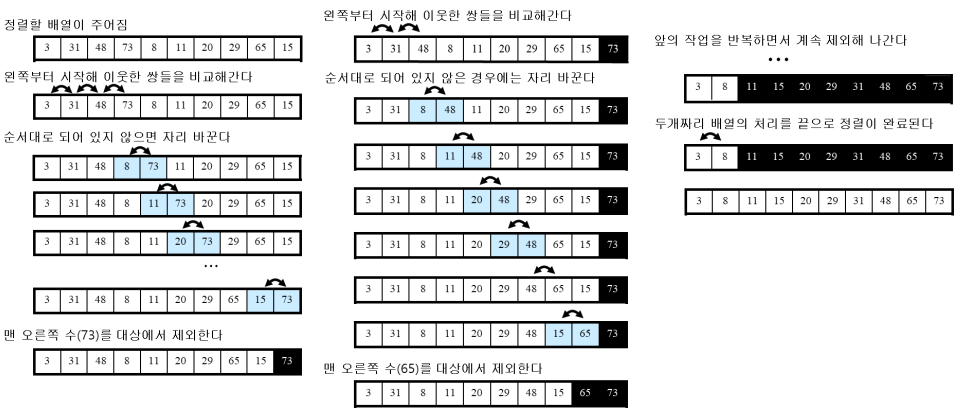
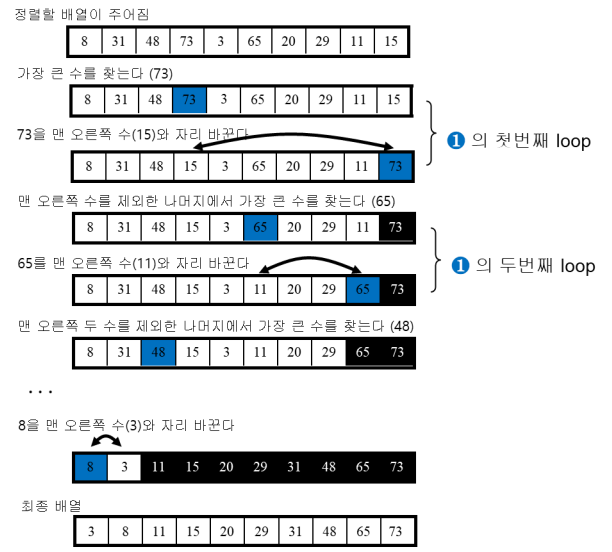
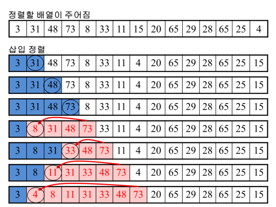

# 버블 정렬, 선택 정렬, 삽입 정렬에 대한 심층 이해와 구현

## 서론

정렬 알고리즘은 컴퓨터 과학에서 데이터를 효율적으로 관리하고 처리하는 데 핵심적인 역할을 한다. 특히 **버블 정렬**, **선택 정렬**, **삽입 정렬**은 기본적인 정렬 알고리즘으로, 알고리즘 학습의 입문 단계에서 중요하게 다뤄진다. 이 글에서는 이 세 가지 정렬 알고리즘의 이론적 배경, 동작 원리, 구현 방법, 시간 복잡도, 그리고 각 알고리즘의 특성과 한계에 대해 자세히 살펴보겠다.

---

## 버블 정렬 (Bubble Sort)

### 개념 및 이론적 배경

버블 정렬은 가장 단순한 형태의 정렬 알고리즘 중 하나로, 인접한 두 요소를 비교하여 필요에 따라 위치를 교환하는 방식을 반복한다. 이 과정에서 큰 값이 리스트의 끝으로 "거품처럼" 떠오르는 모습에서 이름이 유래되었다.

버블 정렬은 비교 기반의 정렬 알고리즘으로, 안정적인(stable) 정렬이다. 이는 동일한 값의 요소들이 정렬 전과 후에 상대적인 순서가 유지됨을 의미한다.

### 알고리즘 동작 원리

1. **초기 설정**: 리스트의 길이를 n이라고 할 때, 외부 반복문은 총 n-1회 실행된다.
2. **인접 요소 비교**: 내부 반복문에서 리스트의 첫 번째 요소부터 시작하여 인접한 두 요소를 비교한다.
3. **교환 조건**: 앞의 요소가 뒤의 요소보다 크면 두 요소의 위치를 교환한다.
4. **반복**: 이 과정을 리스트의 끝까지 반복하면 가장 큰 요소가 리스트의 끝에 위치하게 된다.
5. **정렬 완료 조건**: 리스트가 완전히 정렬될 때까지 1~4단계를 반복한다.

### 코드 구현 (Python 예제)

```python
def bubble_sort(arr):
    n = len(arr)
    for i in range(n):
        # 요소 교환이 발생했는지 확인하기 위한 플래그
        swapped = False
        for j in range(0, n - i - 1):
            if arr[j] > arr[j + 1]:
                # 요소 교환
                arr[j], arr[j + 1] = arr[j + 1], arr[j]
                swapped = True
        # 요소 교환이 없으면 정렬 완료
        if not swapped:
            break
```

### 시간 복잡도 분석

- **최악의 경우 시간 복잡도**: O(n²)
  - 리스트가 역순으로 정렬된 경우, 모든 요소에 대해 최대 비교와 교환이 필요하다.
- **최선의 경우 시간 복잡도**: O(n)
  - 리스트가 이미 정렬된 경우, 요소 교환이 발생하지 않으므로 한 번의 패스로 정렬이 완료된다.
- **평균 시간 복잡도**: O(n²)
  - 무작위로 정렬된 리스트에 대해 평균적으로 O(n²)의 시간이 소요된다.

### 공간 복잡도

- **공간 복잡도**: O(1)
  - 추가적인 배열이나 리스트를 사용하지 않고, 주어진 리스트 내에서 정렬이 이루어지므로 상수 공간만 필요하다.

### 알고리즘의 특성

- **안정성**: 안정적인 정렬 알고리즘이다.
- **적용 사례**: 구현이 간단하지만, 성능이 좋지 않아 실무에서는 거의 사용되지 않는다. 교육 목적으로 주로 사용된다.
- **장점**:
  - 구현이 매우 간단하다.
  - 이미 정렬된 경우 빠르게 완료된다.
- **단점**:
  - 시간 복잡도가 높아 대규모 데이터에는 부적합하다.

---

## 선택 정렬 (Selection Sort)

### 개념 및 이론적 배경

선택 정렬은 리스트에서 가장 작은 요소를 찾아 해당 위치로 이동시키는 과정을 반복하는 알고리즘이다. 이름에서 알 수 있듯이, 각 단계에서 특정 요소를 "선택"하여 정렬된 부분에 추가한다.

선택 정렬은 비교 기반의 불안정한(unstable) 정렬 알고리즘이다. 동일한 값의 요소들이 정렬 과정에서 상대적인 순서가 변경될 수 있다.

### 알고리즘 동작 원리


1. **최소값 탐색**: 리스트의 미정렬 부분에서 최소값을 찾는다.
2. **위치 교환**: 최소값을 현재 위치의 요소와 교환한다.
3. **인덱스 증가**: 다음 위치로 이동하여 1~2단계를 반복한다.
4. **정렬 완료 조건**: 리스트의 끝까지 이 과정을 반복하면 전체 리스트가 정렬된다.

### 코드 구현 (Python 예제)

```python
def selection_sort(arr):
    n = len(arr)
    for i in range(n):
        min_idx = i
        # 미정렬 부분에서 최소값 찾기
        for j in range(i + 1, n):
            if arr[j] < arr[min_idx]:
                min_idx = j
        # 최소값을 현재 위치로 이동
        arr[i], arr[min_idx] = arr[min_idx], arr[i]
```

### 시간 복잡도 분석

- **최악의 경우 시간 복잡도**: O(n²)
  - 모든 경우에 대해 동일한 시간 복잡도를 가진다.
- **최선의 경우 시간 복잡도**: O(n²)
  - 이미 정렬된 리스트에서도 모든 요소에 대해 비교가 필요하다.
- **평균 시간 복잡도**: O(n²)
  - 데이터의 분포와 관계없이 항상 O(n²)의 시간이 소요된다.

### 공간 복잡도

- **공간 복잡도**: O(1)
  - 추가적인 메모리 사용 없이 제자리(in-place)에서 정렬이 이루어진다.

### 알고리즘의 특성

- **안정성**: 불안정한 정렬 알고리즘이다.
  - 동일한 값의 요소들이 교환 과정에서 순서가 바뀔 수 있다.
- **적용 사례**: 작은 데이터셋이나 메모리 사용이 제한된 환경에서 사용될 수 있다.
- **장점**:
  - 구현이 간단하다.
  - 데이터 이동 횟수가 비교적 적다.
- **단점**:
  - 시간 복잡도가 높아 대규모 데이터에는 부적합하다.
  - 최선의 경우에도 O(n²)의 시간이 소요된다.

---

## 삽입 정렬 (Insertion Sort)

### 개념 및 이론적 배경

삽입 정렬은 부분적으로 정렬된 리스트를 유지하며, 정렬되지 않은 요소를 하나씩 정렬된 부분의 적절한 위치에 "삽입"하는 알고리즘이다. 인간이 카드 놀이에서 손패를 정렬하는 방식과 유사하다.

삽입 정렬은 비교 기반의 안정적인 정렬 알고리즘이다.

### 알고리즘 동작 원리

1. **초기 설정**: 리스트의 두 번째 요소부터 시작한다.
2. **현재 요소 선택**: 현재 위치의 요소를 key로 저장한다.
3. **정렬된 부분 탐색**: key보다 큰 요소들을 한 칸씩 뒤로 이동시킨다.
4. **삽입 위치 결정**: key를 올바른 위치에 삽입한다.
5. **반복**: 리스트의 끝까지 2~4단계를 반복한다.

### 코드 구현 (Python 예제)

```python
def insertion_sort(arr):
    n = len(arr)
    for i in range(1, n):
        key = arr[i]
        j = i - 1
        # 정렬된 부분에서 삽입 위치 찾기
        while j >= 0 and arr[j] > key:
            arr[j + 1] = arr[j]
            j -= 1
        # key를 올바른 위치에 삽입
        arr[j + 1] = key
```

### 시간 복잡도 분석

- **최악의 경우 시간 복잡도**: O(n²)
  - 역순으로 정렬된 데이터에서는 모든 요소에 대해 최대 이동이 필요하다.
- **최선의 경우 시간 복잡도**: O(n)
  - 이미 정렬된 리스트의 경우, 비교만 하고 요소 이동이 발생하지 않는다.
- **평균 시간 복잡도**: O(n²)
  - 일반적인 경우에 평균적으로 O(n²)의 시간이 소요된다.

### 공간 복잡도

- **공간 복잡도**: O(1)
  - 추가적인 배열 없이 주어진 리스트 내에서 정렬이 이루어진다.

### 알고리즘의 특성

- **안정성**: 안정적인 정렬 알고리즘이다.
- **적용 사례**:
  - 작은 데이터셋에서 효율적이다.
  - 부분적으로 정렬된 리스트에서 성능이 우수하다.
- **장점**:
  - 구현이 간단하고 이해하기 쉽다.
  - 데이터가 거의 정렬된 경우 빠르게 동작한다.
- **단점**:
  - 대규모 데이터에는 비효율적이다.

---

## 알고리즘 비교 및 심층 분석

### 시간 복잡도 비교

| 알고리즘     | 최선 시간 복잡도 | 평균 시간 복잡도 | 최악 시간 복잡도 | 공간 복잡도 | 안정성 |
| ------------ | ---------------- | ---------------- | ---------------- | ----------- | ------ |
| 버블 정렬    | O(n)             | O(n²)            | O(n²)            | O(1)        | 안정적 |
| 선택 정렬    | O(n²)            | O(n²)            | O(n²)            | O(1)        | 불안정 |
| 삽입 정렬    | O(n)             | O(n²)            | O(n²)            | O(1)        | 안정적 |

### 안정성

- **안정적인 정렬**: 버블 정렬, 삽입 정렬
  - 동일한 값의 요소들이 정렬 전후에 순서가 유지된다.
- **불안정한 정렬**: 선택 정렬
  - 동일한 값의 요소들이 위치 교환으로 인해 순서가 바뀔 수 있다.

### 알고리즘 선택 기준

- **데이터 규모**: 작은 데이터셋에서는 세 알고리즘 모두 사용할 수 있지만, 데이터가 많아질수록 삽입 정렬이 상대적으로 효율적이다.
- **데이터의 초기 정렬 상태**:
  - **거의 정렬된 데이터**: 삽입 정렬이 가장 효율적이다.
  - **무작위 데이터**: 세 알고리즘 모두 O(n²)의 시간이 소요되므로 다른 효율적인 정렬 알고리즘(예: 퀵 정렬, 병합 정렬)을 고려해야 한다.
- **메모리 제한**: 추가적인 메모리 사용이 제한된 환경에서는 제자리 정렬인 이 알고리즘들이 유용하다.

### 각 알고리즘의 한계와 개선 방안

- **버블 정렬**:
  - **한계**: 모든 경우에 대해 비교와 교환이 빈번하게 발생하여 비효율적이다.
  - **개선 방안**: 요소 교환이 발생하지 않으면 반복을 중단하는 최적화가 가능하지만, 근본적인 시간 복잡도를 개선하지는 못한다.
- **선택 정렬**:
  - **한계**: 최선의 경우에도 O(n²)의 시간이 소요된다.
  - **개선 방안**: 힙 정렬을 통해 선택 과정을 효율화할 수 있다.
- **삽입 정렬**:
  - **한계**: 역순으로 정렬된 데이터에서는 비효율적이다.
  - **개선 방안**: 셸 정렬을 통해 삽입 과정을 최적화할 수 있다.

---

## 결론

버블 정렬, 선택 정렬, 삽입 정렬은 알고리즘 학습의 기초를 다지는 데 중요한 역할을 한다. 이들은 구현이 간단하고 개념이 직관적이지만, 시간 복잡도가 O(n²)이므로 대규모 데이터에는 적합하지 않다.

- **버블 정렬**은 구현이 가장 간단하지만, 실제로는 거의 사용되지 않는다.
- **선택 정렬**은 데이터 이동 횟수가 적지만, 불안정하고 성능이 좋지 않다.
- **삽입 정렬**은 작은 데이터셋이나 부분적으로 정렬된 데이터에서 효율적이다.

이러한 기본 정렬 알고리즘을 깊이 이해함으로써 더 복잡하고 효율적인 정렬 알고리즘(예: 퀵 정렬, 병합 정렬, 힙 정렬)을 학습하는 데 기반을 마련할 수 있다.

---

## 참고 자료

- [위키백과 - 정렬 알고리즘](https://ko.wikipedia.org/wiki/정렬_알고리즘)
- [GeeksforGeeks - Sorting Algorithms](https://www.geeksforgeeks.org/sorting-algorithms/)
- [Algorithms, 4th Edition by Robert Sedgewick and Kevin Wayne](https://algs4.cs.princeton.edu/home/)

---

## 추가 학습 자료

- **퀵 정렬(Quick Sort)**: 평균 시간 복잡도가 O(n log n)인 효율적인 정렬 알고리즘이다.
- **병합 정렬(Merge Sort)**: 안정적인 정렬 알고리즘으로, 항상 O(n log n)의 시간 복잡도를 가진다.
- **힙 정렬(Heap Sort)**: 선택 정렬을 개선한 알고리즘으로, 최악의 경우에도 O(n log n)의 시간 복잡도를 가진다.
- **셸 정렬(Shell Sort)**: 삽입 정렬을 일반화한 알고리즘으로, 특정 간격만큼 떨어진 요소들을 비교하여 정렬한다.

